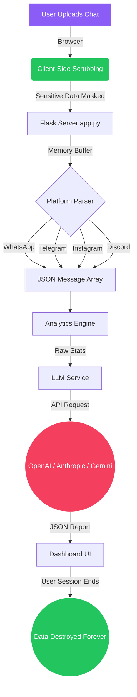

<div align="center">
  

  <h1>The Algorithm</h1>
  <p><strong>A paranoid-level, privacy-first AI relationship analyzer.</strong></p>
  <p>Stop sending your most intimate chat history to random servers.</p>

  <p>
    <a href="https://img.shields.io/badge/python-3.11+-blue?style=for-the-badge&logo=python&logoColor=white"></a>
    <a href="https://img.shields.io/badge/Flask-3.0+-black?style=for-the-badge&logo=flask&logoColor=white"></a>
    <a href="https://img.shields.io/badge/Privacy-100%25%20Zero--Knowledge-22c55e?style=for-the-badge"></a>
  </p>

  <h3>🚀 <a href="https://thealgorithm.rixabh.workers.dev/">Try the Live App Here</a></h3>
</div>

<hr/>

## 📖 Overview

**The Algorithm** is an open-source tool that analyzes exported chat logs from WhatsApp, Telegram, Instagram, and Discord to generate comprehensive behavioral insights and relationship coaching.

Unlike other platforms that store and read your data, The Algorithm operates on a strict **zero-knowledge, BYOK (Bring Your Own Key)** architecture. Your chat data is parsed in volatile memory, anonymized on the edge, and instantly destroyed the millisecond the analysis completes.

## ✨ Features

- **Deep AI Analysis**: Generate an instant "Spotify Wrapped" style report detailing communication health, attachment styles, humor synchronization, and areas for growth.
- **True Cross-Platform**: Natively supports chat exports from `WhatsApp (.txt)`, `Telegram (.html)`, `Instagram (.json)`, and `Discord (.json)`.
- **Bring Your Own Key (BYOK)**: Supports Google Gemini, Anthropic Claude, and OpenAI GPT-4o. You provide the API key; we provide the engine.
- **Glassmorphism UI**: A gorgeous, modern dark-mode interface built with Vanilla Tailwind CSS and subtle CSS micro-animations.

## 🛡️ Zero-Knowledge Architecture

We don't want your data. Period.

1. **Client-Side Anonymization**: Optional "Sensitive Mode" redacts Personally Identifiable Information (PII) like emails, phone numbers, and full names directly in the browser *before* it touches our server.
2. **Pure RAM Processing**: We refuse to use a database. Uploaded files are streamed into active memory, parsed, and never written permenantly to disk.
3. **Aggressive Deletion**: A strict Python `finally` block guarantees that all temporary memory associated with your session is permanently destroyed instantly.
4. **Stats-Only LLM Pipeline**: Your raw chat logs are *never* sent to OpenAI, Anthropic, or Google. Our Python backend processes the chats locally and sends only an anonymous, numerical statistical payload to the LLM.

## 🚀 Getting Started Locally

Running The Algorithm on your own machine takes less than two minutes.

### Prerequisites
- Python 3.11+
- Virtualenv or Conda (recommended)

### Installation

1. Clone the repository and navigate to the project directory:
   ```bash
   git clone https://github.com/rixabhh/TheAlgorithm.git
   cd TheAlgorithm
   ```

2. Create a virtual environment and install dependencies:
   ```bash
   python -m venv venv
   source venv/bin/activate  # On Windows: venv\Scripts\activate
   pip install -r requirements.txt
   ```

3. Run the Flask application:
   ```bash
   python app.py
   ```

4. Open `http://127.0.0.1:7860` in your browser.

## 🐳 Docker Deployment

The Algorithm is fully dockerized and ready for production deployment on render, Railway, or VPS.

```bash
docker build -t the-algorithm .
docker run -p 7860:7860 the-algorithm
```

## 🏗️ Architecture Flowchart



## 📂 Project Structure

```text
TheAlgorithm/
├── app.py                  # Main Flask application & routes
├── core/
│   ├── analytics.py        # Calculates conversation statistics
│   ├── llm_service.py     # Handles external BYOK LLM API requests
│   └── parsers.py          # Platform-specific chat parsers (WA, TG, IG, Discord)
├── static/
│   ├── css/style.css       # Tailwind & Glassmorphism design system
│   ├── js/                 # Client-side UI logic and PII scrubbing
│   └── fonts/              # Self-hosted fonts for privacy
├── templates/
│   ├── index.html          # Landing page & upload interface
│   ├── dashboard.html      # Analytics & Insights display
│   ├── instructions.html   # Export walkthroughs per platform
│   └── privacy.html        # Detailed zero-knowledge policy
├── .github/workflows/      # CI/CD and Hugging Face deployment Action
└── requirements.txt        # Python dependencies
```

## 🤝 Contributors

Contributions are completely welcome! Be it adding support for a new chat platform, improving the analytical models, or refining the UI.

1. Fork the Project
2. Create your Feature Branch (`git checkout -b feature/AmazingFeature`)
3. Commit your Changes (`git commit -m 'Add some AmazingFeature'`)
4. Push to the Branch (`git push origin feature/AmazingFeature`)
5. Open a Pull Request

## 📜 License
This project is licensed under the MIT License - see the [LICENSE](LICENSE) file for details.