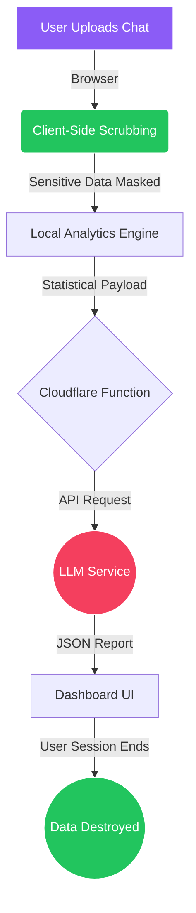

<div align="center">
  

  <h1>The Algorithm</h1>
  <p><strong>A paranoid-level, privacy-first AI relationship analyzer.</strong></p>
  <p>Stop sending your most intimate chat history to random servers.</p>

  <p>
    <a href="https://img.shields.io/badge/JavaScript-ES6+-yellow?style=for-the-badge&logo=javascript&logoColor=white"></a>
    <a href="https://img.shields.io/badge/Cloudflare_Pages-Serverless-orange?style=for-the-badge&logo=cloudflare&logoColor=white"></a>
    <a href="https://img.shields.io/badge/Privacy-100%25%20Zero--Knowledge-22c55e?style=for-the-badge"></a>
  </p>

  <h3>🚀 <a href="https://the-algorithm.pages.dev/">Try the Live App Here</a></h3>
</div>

<hr/>

## 📖 Overview

**The Algorithm** is an open-source tool that analyzes exported chat logs from WhatsApp, Telegram, Instagram, and Discord to generate comprehensive behavioral insights and relationship coaching.

Unlike other platforms that store and read your data, The Algorithm operates on a strict **zero-knowledge, BYOK (Bring Your Own Key)** architecture. Your chat data is parsed in volatile memory, anonymized on the edge, and instantly destroyed the millisecond the analysis completes.

## ✨ Features

- **Deep AI Analysis**: Generate an instant "Spotify Wrapped" style report detailing communication health, attachment styles, humor synchronization, and areas for growth.
- **True Cross-Platform**: Natively supports chat exports from `WhatsApp (.txt)`, `Telegram (.html)`, `Instagram (.json)`, and `Discord (.json)`.
- **Bring Your Own Key (BYOK)**: Supports Google Gemini, Anthropic Claude, and OpenAI GPT-4o. You provide the API key; we provide the engine.
- **Retro Groovy Pop-Art UI**: A gorgeous, vibrant interface featuring paper grain textures, bold typography, and personality-driven design.
- **Shareable Vibe Card**: Export a beautifully designed snap of your relationship stats (Total Messages, Share %, Avg Response, and Mirroring).
- **Customizable Analysis Tone**: Control the AI's personality by choosing between Playful, Balanced, or Direct analysis modes.

## 🛡️ Zero-Knowledge Architecture

We don't want your data. Period.

1. **Client-Side Anonymization**: Personally Identifiable Information (PII) like emails, phone numbers, and full names are heavily redacted directly in the browser *before* the data touches the server functions.
2. **Purely Local Processing**: We prioritize privacy. Most analysis happens directly in your browser.
3. **Aggressive Deletion**: No data is persisted. Files are processed in memory and never written to disk.
4. **Stats-Only LLM Pipeline**: Your raw chat logs are *never* sent to the LLM. Our local engine processes the chats and sends only an anonymous, numerical statistical payload to the AI service.

Running The Algorithm on your own machine is simple using Wrangler.

### Prerequisites
- Node.js (v18+)
- npm or yarn

### Installation

1. Clone the repository and navigate to the project directory:
   ```bash
   git clone https://github.com/rixabhh/TheAlgorithm.git
   cd TheAlgorithm
   ```

2. Install dependencies (Wrangler):
   ```bash
   npm install
   ```

3. Run the application locally:
   ```bash
   npx wrangler pages dev .
   ```

4. Open `http://localhost:8788` in your browser.

The Algorithm is built for Cloudflare Pages. You can deploy it instantly by connecting your GitHub repo to the Cloudflare dashboard.

```bash
npx wrangler pages deploy .
```

## 🏗️ Architecture Flowchart



## 📂 Project Structure

```text
TheAlgorithm/
├── functions/              # Cloudflare Pages Functions (Serverless Backend)
│   └── api/
│       └── analyze.js      # Handles LLM API orchestration
├── static/
│   ├── js/                 # Client-side logic & local analytics engine
│   ├── css/                # Retro Pop-Art design system
│   └── fonts/              # Privacy-first self-hosted fonts
├── index.html              # Landing page & upload interface
├── dashboard.html          # Analytics & Insights display
├── wrangler.toml           # Cloudflare configuration
└── package.json            # Node.js dependencies & scripts
```

## 🤝 Contributors

Contributions are completely welcome! Be it adding support for a new chat platform, improving the analytical models, or refining the UI.

1. Fork the Project
2. Create your Feature Branch (`git checkout -b feature/AmazingFeature`)
3. Commit your Changes (`git commit -m 'Add some AmazingFeature'`)
4. Push to the Branch (`git push origin feature/AmazingFeature`)
5. Open a Pull Request

## 📜 License
This project is licensed under the MIT License - see the [LICENSE](LICENSE) file for details.