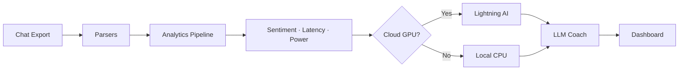

<p align="center">


</p>

# 🧠 The Algorithm

> **A privacy-first, AI-powered relationship analyzer.**
> Upload your chat exports. Get deep behavioral insights, emotional analytics, and actionable coaching — all without your raw text ever leaving your machine.

<p align="center">


</p>

---

## ✨ Features

| Feature | Description |
| --- | --- |
| 🔐 **Absolute Privacy** | All NLP processing (sentiment analysis, latency, power dynamics) runs **locally on your hardware**. Raw chat text is never sent to any external service. |
| 🤖 **BYOK LLM Coaching** | Bring Your Own Key — connect OpenAI (GPT-4o), Anthropic (Claude 3.5), or Google (Gemini 2.5 Flash) for personalized narrative reports and coaching nudges. |
| 🌍 **Hinglish Support** | Uses a quantized multilingual XLM-RoBERTa model fine-tuned for code-mixed and multilingual chat. |
| 📊 **Deep Analytics** | Emotional Journey, Communication Flow, Response Synchrony, Power Dynamics, Affection vs. Friction, Emoji Analysis, Initiator Balance, and more. |
| 🎯 **AI Text Insights** | Every chart and metric includes a concise, AI-generated explanation of what the data means for your relationship. |
| 💬 **Multi-Platform** | Supports WhatsApp (`.txt`), Telegram (`.html`), Instagram (`.json`), Discord (`.json`), and exported PDFs. |
| ⚡ **Cloud GPU Offload** | Optionally offload heavy sentiment analysis to a free Lightning AI GPU for 50x faster processing on large chats. |
| 🐳 **Docker Ready** | Production-ready Dockerfile with bundled models for instant, isolated execution. |

---

## 🚀 Quick Start

You can run The Algorithm either directly via Python or isolated within a Docker container.

### Option A: Run Natively (Python)

**Prerequisites:** Python 3.11+ and `pip`

1. **Clone & Install**
```bash
git clone https://github.com/rixabhh/the-algorithm.git
cd the-algorithm
pip install -r requirements.txt

```


2. **Run Locally**
```bash
python app.py

```


3. Open `http://localhost:5000` in your browser.

### Option B: Run via Docker

The project includes a Dockerfile that bundles the sentiment model (~1.1GB) during the build phase, eliminating cold-start downloads.

1. **Build the Image**
```bash
docker build -t the-algorithm .

```


2. **Run the Container**
```bash
docker run -p 5000:5000 -e MODEL_DIR=/app/models/sentiment the-algorithm

```


3. Open `http://localhost:5000` in your browser.

### Configure Your AI Coach

Once the app is running, click the ⚙️ **Settings** icon in the app header → select your LLM provider → paste your API key. *The key is stored securely in your browser's `localStorage` and never touches the backend.*

---

## 🏗️ Architecture

```text
The Algorithm/
├── app.py                   # Flask entry point & routes
├── Dockerfile               # Local Docker environment build
├── requirements.txt         # Python dependencies
│
├── core/                    # Backend logic module
│   ├── analytics.py         # Sentiment engine, risk scores, power dynamics
│   ├── llm_service.py       # LLM provider abstraction (OpenAI/Anthropic/Gemini)
│   └── parsers.py           # Multi-platform chat file parsers
│
├── scripts/
│   └── download_model.py    # Pre-downloads the ML model for Docker builds
│
├── cloud_api/               # Optional: GPU offload server for Lightning AI
│   ├── app.py
│   └── requirements.txt
│
├── static/
│   ├── css/style.css        # Design system & glassmorphism styles
│   └── js/
│       ├── app.js           # Upload form & settings logic
│       └── dashboard.js     # Chart rendering & insight population
│
├── templates/
│   ├── index.html           # Landing page & upload form
│   ├── dashboard.html       # Analytics dashboard
│   └── instructions.html    # Platform-specific export guides
│
└── docs/                    # Product requirement documents

```

### Data Flow



---

## ☁️ Cloud GPU Offload (Optional)

For massive chats (10,000+ messages), local CPU sentiment analysis can take a while. You can securely offload just the sentiment processing to a **free Lightning AI GPU** for 50x faster processing:

1. Create a free account at [lightning.ai](https://lightning.ai/)
2. Start a new Studio (PyTorch environment).
3. Upload the `cloud_api/` folder to the Studio.
4. Run the API:
```bash
cd cloud_api
pip install -r requirements.txt
uvicorn app:app --host 0.0.0.0 --port 8000

```


5. Open the **Port Viewer** plugin in Lightning AI → add port `8000` → copy the public URL.
6. In your local Algorithm app: Go to **Settings** → paste the URL + `/analyze` (e.g., `https://studio-id-8000.lit.ai/analyze`).

---

## 📊 Analytics Breakdown

| Metric | What it Measures |
| --- | --- |
| **Emotional Journey** | Weekly risk score derived from sentiment, latency, and volume |
| **Communication Flow** | Message frequency trends over time |
| **Response Synchrony** | Median reply latency patterns |
| **Who Texts First** | Conversation initiation balance (4-hour gap threshold) |
| **Power Dynamics** | Word count ratio — who drives the narrative |
| **Affection vs. Friction** | Affirmative language vs. dismissive language tokens |
| **Emoji Frequency** | Top 10 emojis per person |
| **Support Gap** | How each person responds to the other's stress signals |
| **Linguistic Mirroring** | Vocabulary convergence over time |
| **Topic Mix** | Logistics vs. Intimacy vs. Conflict vs. External |

---

## 🔒 Privacy Model

```text
┌─────────────────────────────────────────┐
│            YOUR MACHINE                 │
│                                         │
│  Chat File → Parser → NLP Engine        │
│                ↓                        │
│        Statistical Summary              │
│         (no raw text)                   │
│                ↓                        │
│     ┌─── BYOK LLM API ───┐              │
│     │  Only aggregated   │              │
│     │  stats are sent    │              │
│     └─────────────────────┘             │
│                ↓                        │
│            Dashboard                    │
│                                         │
│  ⚡ Files deleted immediately            │
│     after processing                    │
└─────────────────────────────────────────┘

```

* **Raw text** never leaves your machine.
* **Uploaded files** are deleted instantly from local storage after processing.
* **API keys** are stored securely in your browser's `localStorage`.
* **Session data** exists only in temporary server memory.

---

## 🛠️ Tech Stack

| Layer | Technology |
| --- | --- |
| **Backend** | Python, Flask, Pandas, NumPy |
| **NLP** | HuggingFace Transformers, XLM-RoBERTa (quantized) |
| **Frontend** | Tailwind CSS, Chart.js, Vanilla JS |
| **LLM** | OpenAI GPT-4o / Anthropic Claude 3.5 / Google Gemini 2.5 Flash |
| **Containerization** | Docker, Gunicorn |

---

## 👤 Author

**Rishabh**

* [GitHub](https://github.com/rixabhh)
* [LinkedIn](https://www.linkedin.com/in/rishabbh/)

---

## 📄 License

This project is open source and available under the [MIT License](https://www.google.com/search?q=LICENSE).

---